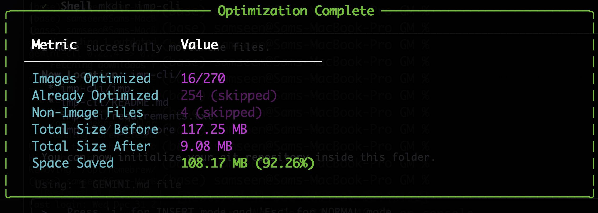

# IMP - Image Manipulation & Optimization CLI

[](LICENSE)
[]()
[]()
[](https://github.com/SamSeenX/homebrew-apps)

> A lightweight, high-performance command-line tool for batch image optimization.

**IMP** streamlines the process of reducing file sizes for web usage or storage archiving while maintaining visual quality. Built with Python, it supports smart compression, WebP conversion, and intelligent resizing—all in one simple CLI.

## ✨ Features

- 🎨 **Smart Compression** - Efficiently compresses JPG and PNG files to reduce footprint
- 🌐 **Modern Formats** - One-flag conversion to **WebP** for superior compression
- 📂 **Batch Processing** - Recursively scans directories to process thousands of images in one go
- 🛡️ **Safety First** - Automatically backs up original files to an `originals/` directory before modification
- 📐 **Intelligent Resizing** - Resize images to specific dimensions while preserving aspect ratio
- 📊 **Progress Tracking** - Visual progress bar with detailed statistics on space saved

## 📸 Demo

<!-- Add a demo GIF or screenshot -->


## 🚀 Quick Start

### Installation

#### macOS (Homebrew) - Recommended

The easiest way to install IMP on macOS:

```bash
brew install SamSeenX/apps/imp
```

That's it! You can now use `imp` from anywhere in your terminal.

#### pip (All Platforms)

```bash
# Clone the repository
git clone https://github.com/SamSeenX/imp-cli.git
cd imp-cli

# Install dependencies
pip install -r requirements.txt

# Make executable and install
chmod +x imp
sudo cp imp /usr/local/bin/imp

# Verify installation
imp --help
```

#### Quick Clone & Run

```bash
git clone https://github.com/SamSeenX/imp-cli.git
cd imp-cli
pip install -r requirements.txt
./imp ./photos
```

### Basic Usage

```bash
# Optimize a single image
imp image.jpg

# Process all images in a folder
imp ./my-photos/
```

## 📖 Documentation

### Configuration

| Option | Default | Description |
|--------|---------|-------------|
| `--webp` | `false` | Convert images to WebP format |
| `--resize <SIZE>` | - | Resize so longest side is at most SIZE pixels |
| `--quality <1-100>` | `69` | Set compression quality level |
| `--pre` | `false` | Preview changes without modifying any files |
| `--nr` | `false` | Non-recursive: only process files in the top-level folder |
| `--rd` | `false` | Recursive distributed: place originals folder in each subfolder |
| `--restore` | - | Restore original files and remove originals folders |
| `--backup <DEST>` | - | Move originals folders to specified backup location |
| `--clean` | - | Delete all originals folders to free up space |

### Examples

```bash
# Basic Optimization (JPG, Quality 69%)
imp image.jpg
imp ./my-photos/

# Convert to WebP
imp ./gallery/ --webp

# Resize Images (longest side = 1920px)
imp ./wallpapers/ --resize 1920

# Custom Quality
imp photo.png --quality 85

# Combine Options (WebP + resize + quality)
imp ./assets/ --webp --resize 1080 --quality 75

# Preview changes without modifying files
imp ./photos/ --pre
imp ./assets/ --webp --resize 1080 --pre

# Non-recursive (only top-level folder)
imp ./photos/ --nr

# Distributed originals (each subfolder gets its own originals/)
imp ./photos/ --rd
```

## 🛡️ Safety & Backups

**IMP** is non-destructive by default. Original files are always backed up before modification.

### Backup Modes

| Mode | Flag | Behavior |
|------|------|----------|
| **Centralized** (default) | - | Single `originals/` folder at root with mirrored structure |
| **Distributed** | `--rd` | Each subfolder gets its own `originals/` subfolder |
| **Non-recursive** | `--nr` | Only process top-level folder |

### After Optimization

IMP provides built-in commands to manage your original files. These work on **all operating systems** (macOS, Linux, Windows).

**Undo changes** - Restore your original files:
```bash
imp <path> --restore
```

**Move to backup** - Archive originals to a backup location:
```bash
imp <path> --backup <destination>

# Example:
imp ./photos --backup ~/backup
```

**Delete originals** - Free up space when you're happy with results:
```bash
imp <path> --clean
```

> **Tip:** These commands automatically find and process all `originals/` folders, whether you used centralized (default) or distributed (`--rd`) mode.

## 🏗️ Project Structure

```
imp-cli/
├── imp               # Main CLI script (Python)
├── brew/             # Homebrew formula
├── requirements.txt  # Python dependencies
├── setup.py          # Package setup
├── assets/           # Demo screenshots
├── website/          # Landing page
├── LICENSE           # MIT License
└── README.md
```

## 🍺 Updating

### Homebrew (macOS)

```bash
brew update && brew upgrade imp
```

### Manual Installation

```bash
cd imp-cli
git pull origin main
```

## 🗺️ Roadmap

- [ ] PNG to JPG conversion option
- [ ] HEIC support
- [x] Dry-run mode to preview changes
- [ ] Output directory option
- [x] WebP conversion
- [x] Smart compression
- [x] Batch processing
- [x] Homebrew installation

## 🤝 Contributing

Contributions are welcome! Please feel free to submit a Pull Request.

1. Fork the repository
2. Create your feature branch (`git checkout -b feature/AmazingFeature`)
3. Commit your changes (`git commit -m 'Add some AmazingFeature'`)
4. Push to the branch (`git push origin feature/AmazingFeature`)
5. Open a Pull Request

## ❓ FAQ

### Why 69 as the default quality?

Nice. But also, it provides a good balance between file size reduction and visual quality for most use cases.

### Will my original files be deleted?

No! IMP automatically backs up your originals to an `originals/` subdirectory before making any changes. So if you want to keep the original files, you can just move them back from the `originals/` directory.

### What image formats are supported?

Currently **JPG**, **JPEG**, and **PNG** files. All images are converted to **JPG** by default to ensure the smallest file size, or **WebP** if the `--webp` flag is used.

## 📝 License

This project is licensed under the MIT License - see the [LICENSE](LICENSE) file for details.

## 🙏 Acknowledgments

- [Pillow](https://pillow.readthedocs.io/) - The Python Imaging Library
- [Rich](https://rich.readthedocs.io/) - Beautiful terminal output

## ☕ Support

If you find this project useful, please consider supporting me:

- ⭐ Starring this repository
- 🐛 Reporting issues
- 💡 Suggesting improvements
- ☕ [Buy me a coffee](https://buymeacoffee.com/samseen)

---

Created with ❤️ by [SamSeen](https://buymeacoffee.com/samseen)
